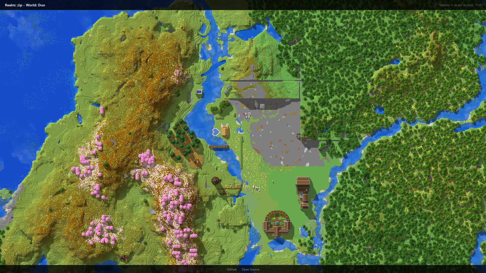

<h1 align="center">Realms Map</h1>

<p align="center">
  Automated map viewer for Minecraft Java Realms — download, render and browse your world anytime
</p>

<p align="center">
  
  
  
  
</p>

---

## Overview

<!-- TODO: Replace with actual screenshot -->

| Map |
|-----|
|  |

## About

Realms Map automatically downloads your Minecraft Java Realms backup, renders an interactive 2D map using [uNmINeD](https://unmined.net/), and deploys it to GitHub Pages. Updated every 12 hours via GitHub Actions.

> This project is not affiliated with, endorsed by, or associated with Mojang Studios or Microsoft.
> Minecraft is a trademark of Mojang Studios.

## Built with

- [Node.js 22](https://nodejs.org/) with TypeScript
- [prismarine-auth](https://github.com/PrismarineJS/prismarine-auth) for Microsoft OAuth
- [prismarine-realms](https://github.com/PrismarineJS/prismarine-realms) for Realms API
- [uNmINeD CLI](https://unmined.net/) for map rendering
- [Vitest](https://vitest.dev/) for unit testing
- [GitHub Actions](https://github.com/features/actions) for CI/CD and deployment

## Features

- Microsoft authentication with device code flow
- Automatic Realms backup download and extraction
- Interactive 2D map with zoom and navigation
- Custom UI with realm name, update timestamp and dark theme
- Retry logic for resilient API calls
- Setup wizard that generates GitHub Secrets
- Automated 12-hour update cycle via GitHub Actions
- GitHub Pages deployment with multi-level caching
- XSS prevention on dynamic content

## Architecture

```
Scheduler (cron every 12h)
       |
       v
Microsoft OAuth (prismarine-auth)
  Device code flow -> Xbox Live -> Minecraft token
       |
       v
Realms API (prismarine-realms)
  Download backup (.tar.gz)
       |
       v
uNmINeD CLI
  Render world -> static HTML map with tiles
       |
       v
Patch Map
  Inject custom header, footer, dark theme
       |
       v
GitHub Pages
  Deploy static site
```

## Project structure

```
src/
  auth.ts         Microsoft authentication setup
  config.ts       Environment variable loading
  logger.ts       Logging utility with timestamps
  patch-map.ts    HTML/CSS/JS injection for custom UI
  realms.ts       Realms API operations and backup extraction
  render.ts       uNmINeD CLI map rendering
  retry.ts        Generic retry utility
  setup.ts        Initial setup wizard
  update.ts       Main update workflow orchestration
tests/
  encode-auth-cache.test.ts
  escape-html.test.ts
  find-world-dir.test.ts
  retry.test.ts
```

## Getting started

### Prerequisites

- [Node.js 22+](https://nodejs.org/)
- A Minecraft Java Edition account with an active Realm

### 1. Fork and clone

Fork this repository on GitHub, then:

```bash
git clone https://github.com/<your-username>/realms-map.git
cd realms-map
npm install
```

### 2. Generate secrets

Run the setup wizard to authenticate and get your credentials:

```bash
cp .env.example .env
npm run setup
```

A device code will be shown in the terminal. Open the URL in your browser, enter the code and sign in with your Microsoft account. The wizard will list your Realms and output two values: `REALM_ID` and `AUTH_CACHE`.

### 3. Configure repository secrets

Go to your fork on GitHub:

1. **Settings** > **Secrets and variables** > **Actions**
2. Click **New repository secret** and add:
   - `REALM_ID` — the ID of the Realm you want to map
   - `AUTH_CACHE` — the base64 string from the setup wizard

### 4. Enable GitHub Pages

1. **Settings** > **Pages**
2. Under **Source**, select **GitHub Actions**

### 5. Run the workflow

1. Go to the **Actions** tab
2. Select **Update Map**
3. Click **Run workflow**

The map will be rendered and deployed to `https://<your-username>.github.io/realms-map/`. After the first run, the workflow updates automatically every 12 hours.

## Tests

```bash
npm test
```

## Contribute

1. Fork the repository
2. Create a feature branch (`git checkout -b feature/my-feature`)
3. Commit your changes
4. Push to the branch (`git push origin feature/my-feature`)
5. Open a Pull Request

## License

Distributed under the MIT License. See [LICENSE](LICENSE) for details.